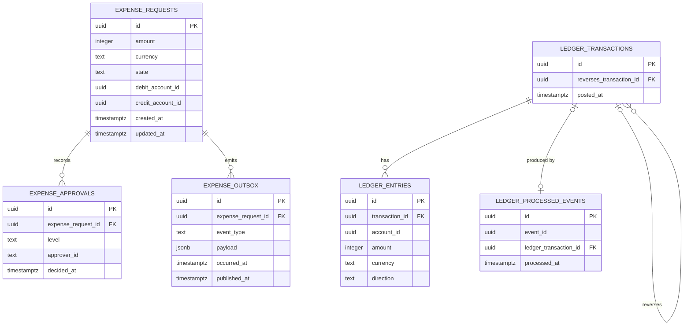

# Data model — Entity-Relationship Diagram

Status: **planned, not yet generated.** No Drizzle table is defined yet — only
the `core` Postgres schema declaration (`drizzle/database/schemas/core.schema.ts`)
and the `generateId` (uuidv7) helper exist. This file is the target shape the
first migration should produce, derived from the two bounded-context specs
(`deltas/expense-approval.spec.md`, `deltas/ledger-accounting.spec.md`) and
`.claude/docs/database.md`. Treat it as a proposal to confirm, not a
description of code that already runs.

Everything lives in the single `core` schema (owned by the `sampler` role,
read/write-granted to the `runner` role — see `database.md`'s Access control).
There is **no other schema split**; the separation between bounded contexts is
by table grouping and naming only, never by a foreign key.

---

## Diagram

Note what's deliberately **not** in the diagram: no line crosses from any
`EXPENSE_*` table to any `LEDGER_*` table. That absence is the point — per
`database.md`, "Approvals and Ledger are expected to own entirely separate
tables, with no foreign key or shared type between them." The only channel
between the two groups is `EXPENSE_OUTBOX` → (relay → queue, outside the
database) → a Ledger use case that inserts into `LEDGER_TRANSACTIONS`.

---

## Table notes

### `expense_requests` — the `ExpenseRequest` aggregate

| Column | Grounding |
|---|---|
| `id` | `ExpenseRequestId` (UUID-backed) |
| `amount`, `currency` | `Money` — amount is a non-negative integer (minor units), never a float |
| `state` | `ExpenseState`: `Pending \| InReview \| Approved \| Rejected` |
| `debit_account_id`, `credit_account_id` | `AccountId` as defined in *this* context's `expense.vos.ts` — nullable because `assignAccounts` may not have been called yet; both must be set before `recordApproval` can succeed (enforced in the domain layer, not by a `NOT NULL` constraint) |
| `created_at` | persistence metadata, not a domain field — timestamp of the row backing `submit`/`ExpenseSubmitted` |
| `updated_at` | persistence metadata — last state-transition write |

The aggregate itself does not store a `decidedAt`/`rejectedAt` field (only the
`ExpenseApproved` event payload carries `approvedAt`), so no such column is
proposed here beyond ordinary `updated_at` bookkeeping.

### `expense_approvals` — the `Approval` entity

One row per recorded approval (`recordApproval`). `level` is `ApprovalLevel`
(`Manager | Finance`), `approver_id` is the opaque, unauthenticated string the
spec describes — no `users`/`approvers` table exists or is planned. FK to
`expense_requests` is a same-context reference, so it's a real foreign key
(unlike anything crossing into Ledger).

### `expense_outbox` — transactional outbox (shape proposed here; `database.md` explicitly calls this "not yet decided")

Written in the same transaction as the `expense_requests`/`expense_approvals`
write that raises `ExpenseApproved`. `payload` is the integration event body —
the spec leaves open whether that's a direct translation of `ExpenseApproved`
or remapped again at the outbox boundary; `payload` is drawn as opaque `jsonb`
so that decision doesn't have to be made to draw the table. `published_at IS
NULL` is the relay's poll predicate; once the relay hands the row to the
queue, it stamps `published_at`.

### `ledger_transactions` / `ledger_entries` — the `LedgerTransaction` aggregate

- `reverses_transaction_id` is `getReversesTransactionId()` — nullable,
  self-referencing. No `updated_at` column: the spec requires a posted
  transaction to be immutable, so there is nothing to update, ever
  (correction = a new row via `reverse`).
- `ledger_entries.id` is a **persistence-only surrogate key** — the spec is
  explicit that an `Entry` "is a value — no identity of its own." The domain
  never addresses an entry by id; it's only there because a relational table
  needs a primary key.
- `ledger_entries.account_id` is Ledger's own `AccountId` — shaped identically
  to Approval's `AccountId` but never the same type or table, per
  `.claude/rules/context-isolation.md`. There is no `accounts` table on either
  side; neither bounded context models an account as an aggregate today, only
  as an opaque UUID reference.
- `direction` is `EntryDirection` (`Debit | Credit`). The debit/credit balance
  invariant (equal sums, same currency) is enforced by the aggregate before
  `post`/`reverse` ever construct a transaction — not by a database constraint.

### `ledger_processed_events` — consumer-side idempotency (proposed; not yet built anywhere)

Addresses the risk called out in `approach.md`: "without a durable record of
already-processed events … a queue redelivery can duplicate a posted
accounting transaction." `event_id` (unique) is the integration event's own
id from the outbox payload, checked before invoking `LedgerTransaction.post`;
`ledger_transaction_id` links back to the row it produced, nullable only
because a redelivery that's rejected before posting would still want a record
of having been seen. This table does not exist in any spec yet — it is
inferred from the stated risk and roadmap phase 5 ("Resilience"), so confirm
the shape before building it.

---

## Open questions this diagram surfaces

- `expense_outbox` and `ledger_processed_events` are both proposed shapes, not
  decisions already made elsewhere — worth a real design pass (roadmap phases
  2 and 5) rather than treating this file as final.
- Whether `expense_outbox.event_type`/`payload` should be a direct dump of
  `ExpenseApproved` or a distinct, versioned integration-event shape is the
  open question `expense-approval.spec.md` already flags — this diagram
  doesn't resolve it, just gives the column a home either way.
- No `accounts` table exists in either context. If accounts ever become a
  real aggregate (rather than a bare UUID reference), that's a new slice, not
  an addition to these tables.
